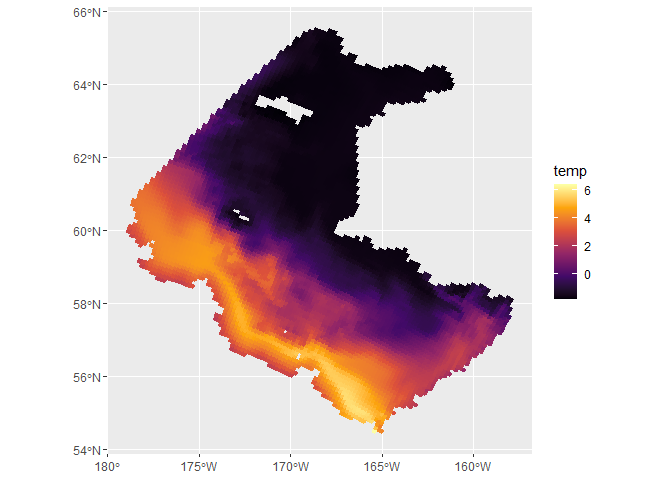

# Gridded Bering10K ROMS from the ACLIM Thredds Server

This package implements functions for browsing, downloading from, and bias-corrected outputs from the [NOAA ACLIM Thredds Server](https://data.pmel.noaa.gov/aclim/thredds/catalog/catalog.html) containing hindcasts, future projections, and historical runs of the the [Bering10K ROMS](https://beringnpz.github.io/roms-bering-sea/B10K-dataset-docs/) models for the Bering Sea. Browse available datasets and variables by visiting the Thredds Server or using `list_level2_datasets`. Currently, datasets downloaded from this package are returned as `stars` objects.

## Installation

`Bering10KThredds` can be installed from GitHub using:

    library("devtools")
    install.packages("mcgoodman/Bering10KThredds")

## Useage

### Downloading Level 2 ROMs output

The `get_level2` function can be used to download weekly gridded outputs as `stars` objects. E.g., to download SSP5-8.5 projections of bottom temperature for 2040-2060 from the GFDL earth systems model:

    library("Bering10KThredds")
    
    var <- "temp_bottom5m"
    
    temp_ssp585 <- get_level2(
      var, start = 2040, end = 2060, 
      type = "projection", scenario = "SSP585", earth_model = "GFDL"
    )

By default, the outputs are cropped to the shape of the Bering Sea Groundfish Assessment Program survey region, but this be disabled by specifying `crop_ebs = FALSE`. The result is a `stars` object with one band for each week:

```R
# Print summary statistics for all cells
print(temp_ssp585, n = prod(dim(temp_ssp585)))
```

```
## stars object with 3 dimensions and 1 attribute
## attribute(s):
##                Min.    1st Qu.   Median     Mean  3rd Qu.     Max.     NA's
## temp [°C] -2.383263 -0.8619338 1.333167 1.434706 3.329926 14.18599 45604560
## dimension(s):
##            from   to                  offset  delta
## xi_rho        1  182                      NA     NA
## eta_rho       1  258                      NA     NA
## ocean_time    1 1096 2040-01-01 12:00:00 UTC 7 days
##                                  refsys                    values x/y
## xi_rho     +proj=longlat +datum=WGS8... [182x258] 156.4,...,215.1 [x]
## eta_rho    +proj=longlat +datum=WGS8...    [182x258] 45,...,69.69 [y]
## ocean_time                      POSIXct                      NULL    
## curvilinear grid
```

Plotting, for example, the first week in this dataset:

```R
library("ggplot2")

ggplot() + 
  geom_stars(aes(fill = temp, color = temp), 
             data = slice(temp_ssp585, 1, along = "ocean_time")) + 
  scale_fill_viridis_c(option = "inferno") + 
  scale_color_viridis_c(option = "inferno")
```




### Delta bias-correcting ROMs projections

The package also supports “delta” bias-correcting ROMS projections, i.e., computing the difference between a hindcast and a model’s historical run for each grid cell and week-of-year as the model’s bias, and adjusting future projections to account for that bias. To do this we also need to download a hindcast and historical run for a reference time period, e.g:

```R
# Download hindcast and historical
temp_hind <- get_level2(var, type = "hindcast", start = 2000, end = 2020)
temp_hist <- get_level2(var, type = "historical", start = 2000, end = 2020, earth_model = "GFDL")

# Delta-correct
temp_ssp585_bc <- temp_ssp585 |> delta_correct(hindcast = temp_hind, historical = temp_hist)
```

In this case, the historical model runs cool on average, so (on average) the bias-corrected projectioned temperatures are higher than the original values. However, because the bias-correction is spatially and seasonally explicit, some areas run hotter - this results in a negative bias correction for these areas, and, in this case, a handful of temperatures which are lower than is possible:

```R
print(temp_ssp585_bc, n = prod(dim(temp_ssp585)))
```

    ## stars object with 3 dimensions and 1 attribute
    ## attribute(s):
    ##                Min.    1st Qu.   Median     Mean  3rd Qu.     Max.     NA's
    ## temp [°C] -5.673966 -0.7911012 1.684106 1.949184 4.182571 20.27514 45604560
    ## dimension(s):
    ##            from   to     offset  delta                       refsys
    ## xi_rho        1  182         NA     NA +proj=longlat +datum=WGS8...
    ## eta_rho       1  258         NA     NA +proj=longlat +datum=WGS8...
    ## ocean_time    1 1096 2040-01-01 7 days                         Date
    ##                               values x/y
    ## xi_rho     [182x258] 156.4,...,215.1 [x]
    ## eta_rho       [182x258] 45,...,69.69 [y]
    ## ocean_time                      NULL    
    ## curvilinear grid

We may therefore want to set a floor:

```R
temp_min <- as.numeric(min(temp_hind$temp, na.rm = TRUE))

temp_ssp585_bc <- temp_ssp585 |> 
  delta_correct(hindcast = temp_hind, historical = temp_hist, lower = temp_min)

print(temp_ssp585_bc, n = prod(dim(temp_ssp585)))
```

```
## stars object with 3 dimensions and 1 attribute
## attribute(s):
##                Min.    1st Qu.   Median     Mean  3rd Qu.     Max.     NA's
## temp [°C] -2.419214 -0.7911012 1.684106 1.958306 4.182571 20.27514 45604560
## dimension(s):
##            from   to     offset  delta                       refsys
## xi_rho        1  182         NA     NA +proj=longlat +datum=WGS8...
## eta_rho       1  258         NA     NA +proj=longlat +datum=WGS8...
## ocean_time    1 1096 2040-01-01 7 days                         Date
##                               values x/y
## xi_rho     [182x258] 156.4,...,215.1 [x]
## eta_rho       [182x258] 45,...,69.69 [y]
## ocean_time                      NULL    
## curvilinear grid
```


### Checking for available datasets

We can list all available simulations on the Thredds server with:

```R
list_level2_datasets(option = "sims")
```

    ##  [1] "B10K-H16_CMIP5_CESM_BIO_rcp85"      "B10K-H16_CMIP5_CESM_rcp85"         
    ##  [3] "B10K-H16_CMIP5_CESM_rcp45"          "B10K-H16_CMIP5_GFDL_BIO_rcp85"     
    ##  [5] "B10K-H16_CMIP5_GFDL_rcp45"          "B10K-H16_CMIP5_GFDL_rcp85"         
    ##  [7] "B10K-H16_CMIP5_MIROC_rcp45"         "B10K-H16_CMIP5_MIROC_rcp85"        
    ##  [9] "B10K-H16_CORECFS"                   "B10K-K20P19_CMIP6_cesm_historical" 
    ## [11] "B10K-K20P19_CMIP6_cesm_ssp126"      "B10K-K20P19_CMIP6_cesm_ssp585"     
    ## [13] "B10K-K20P19_CMIP6_gfdl_historical"  "B10K-K20P19_CMIP6_gfdl_ssp126"     
    ## [15] "B10K-K20P19_CMIP6_gfdl_ssp585"      "B10K-K20P19_CMIP6_miroc_historical"
    ## [17] "B10K-K20P19_CMIP6_miroc_ssp126"     "B10K-K20P19_CMIP6_miroc_ssp585"    
    ## [19] "B10K-K20P19_CORECFS"                "B10K-K20_CORECFS"                  
    ## [21] "B10K-K20nobio_CORECFS_daily"

For a given simulation, all available years and variables can be returned with, e.g.:

```R
datasets <- list_level2_datasets(option = "all", sim = "B10K-K20P19_CMIP6_gfdl_ssp585")

# This is typically a large data frame
head(datasets[,c("sim", "years", "var")])
```

```
##                             sim     years             var
## 1 B10K-K20P19_CMIP6_gfdl_ssp585 2010-2014  Cop_integrated
## 2 B10K-K20P19_CMIP6_gfdl_ssp585 2010-2014   Cop_surface5m
## 3 B10K-K20P19_CMIP6_gfdl_ssp585 2010-2014 EupO_integrated
## 4 B10K-K20P19_CMIP6_gfdl_ssp585 2010-2014  EupO_surface5m
## 5 B10K-K20P19_CMIP6_gfdl_ssp585 2010-2014 EupS_integrated
## 6 B10K-K20P19_CMIP6_gfdl_ssp585 2010-2014  EupS_surface5m
```

For a given variable and simulation, the range of years available can be checked with, e.g.:

```R
check_availability(var, type = "projection", scenario = "SSP585", earth_model = "GFDL")
```

    ## variable temp_bottom5m available for the following time blocks:
    ## 2010-2014
    ## 2015-2019
    ## 2020-2024
    ## 2025-2029
    ## 2030-2034
    ## 2035-2039
    ## 2040-2044
    ## 2045-2049
    ## 2050-2054
    ## 2055-2059
    ## 2060-2064
    ## 2065-2069
    ## 2070-2074
    ## 2075-2079
    ## 2080-2084
    ## 2085-2089
    ## 2090-2094
    ## 2095-2099

## References

For description of ROMS models, see:

Hermann AJ, Gibson GA, Bond NA, Curchitser EN, Hedstrom K, Cheng W, Wang M, Cokelet ED, Stabeno PJ, Aydin K (2016). “Projected future biophysical states of the Bering Sea.” Deep-Sea Research Part II: Topical Studies in Oceanography, 134, 30–47. ISSN 09670645, <doi:10.1016/j.dsr2.2015.11.001>, Publisher: Elsevier, <http://dx.doi.org/10.1016/j.dsr2.2015.11.001>.

Kearney KA, Hermann A, Cheng W, Ortiz I, Aydin K (2020). “A coupled pelagic–benthic–sympagic biogeochemical model for the Bering Sea: documentation and validation of the BESTNPZ model (v2019.08.23) within a high-resolution regional ocean model.” Geoscientific Model Development, 13(2), 597–650. ISSN 1991-9603, <doi:10.5194/gmd-13-597-2020>, <https://gmd.copernicus.org/articles/13/597/2020/>.

Pilcher DJ, Naiman DM, Cross JN, Hermann AJ, Siedlecki SA, Gibson GA, Mathis JT (2019). “Modeled Effect of Coastal Biogeochemical Processes, Climate Variability, and Ocean Acidification on Aragonite Saturation State in the Bering Sea.” Frontiers in Marine Science, 5, 508. ISSN 2296-7745, <doi:10.3389/fmars.2018.00508>, <https://www.frontiersin.org/article/10.3389/fmars.2018.00508/full>.

## Disclaimer

This repository is a scientific product and is not official communication of the National Oceanic and Atmospheric Administration, or the United States Department of Commerce. All NOAA GitHub project code is provided on an ‘as is’ basis and the user assumes responsibility for its use. Any claims against the Department of Commerce or Department of Commerce bureaus stemming from the use of this GitHub project will be governed by all applicable Federal law. Any reference to specific commercial products, processes, or services by service mark, trademark, manufacturer, or otherwise, does not constitute or imply their endorsement, recommendation or favoring by the Department of Commerce. The Department of Commerce seal and logo, or the seal and logo of a DOC bureau, shall not be used in any manner to imply endorsement of any commercial product or activity by DOC or the United States Government.
