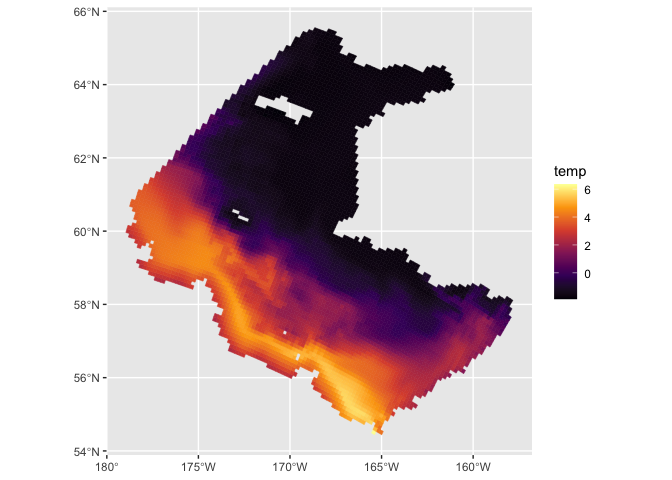

# Eastern Bering Sea survey and oceanographic data

This package contains functions for downloading and processing:

-   Survey data from the NOAA AFSC Groundfish Assessment Program (GAP)
    Bering Sea survey and other standardized surveys in Alaska waters.
-   Estimates from the MOM6 Northeastern Pacific (NEP) oceangraphic
    model hindcast
-   Estimates from the Bering 10K ROMS (/ROMS-NPZ) oceanographic model
    including the hindcast, historical runs, and projections

Currently, MOM6 and ROMS datasets downloaded from this package are
returned as `stars` objects. The package also contains some other
spatial datasets (bathymetry, sediment grain size, and various
shapefiles), as well as utilities for processing `stars` objects.

These functions were written at different times, for different projects,
using (necessarily) different APIs, and therefore may not share a
cohesive syntax.

## Installation

`BeringSeaData` can be installed from GitHub using:

    library("devtools")
    install_github("mcgoodman/BeringSeaData")

## AFSC GAP survey data

The functions `get_catch`, `get_hauldata`, and `get_species_codes` are
wrappers for the GAP API documented
[here](https://afsc-gap-products.github.io/gap_products/content/foss-api-r.html).
To download, for example, all positive tows for walleye pollock from the
EBS (SEBS + NBS) survey, and add in the data for hauls with zero catch,
use:

    library("BeringSeaData")
    plk_code <- get_species_codes("Gadus chalcogrammus")
    plk_data <- get_catch(plk_code, zero_expand = TRUE, survey = "EBS")

## MOM6 NEP model

Variables from the MOM6 NEP hindcast (listed on the [CEFI
Portal](https://psl.noaa.gov/cefi_portal/)) can be downloaded and
returned as a `stars` object using `get_mom6_nep`. Available variables
for each data category and output frequency can be browsed using the
data query generator on the CEFI Portal.

By default the outputs are cropped to the extent of the EBS survey
region, but can be cropped to any region within the NEP model domain by
passing a different shapefile (as an `sf` object) or bounding box to the
`extent` argument. E.g., to download monthly bottom temperature for the
EBS region between 2020 and 2024:

    temp_mom6 <- get_mom6_nep(
      var = "tob", 
      start_date = as.Date("2020-01-01"), 
      end_date = as.Date("2024-12-31")
    )

The result is a 3-dimensional `stars` object with a band for each month:

    # Print summary statistics for all cells
    print(temp_mom6, n = prod(dim(temp_mom6)))

    ## stars object with 3 dimensions and 1 attribute
    ## attribute(s):
    ##              Min.  1st Qu.   Median     Mean  3rd Qu.     Max.   NA's
    ## tob [1] -1.963169 0.218686 2.165639 2.263047 3.871479 15.73961 314160
    ## dimension(s):
    ##      from  to  offset  delta               refsys                    values x/y
    ## x       6 104   -7679  12411 WGS 84 / UTM zone 2N                      NULL [x]
    ## y       6 103 7330028 -12411 WGS 84 / UTM zone 2N                      NULL [y]
    ## time    1  60      NA     NA                 Date 2020-01-01,...,2024-12-01

## Bering 10K ROMS model

This package also implements functions for browsing, downloading from,
and bias-corrected outputs from the [NOAA ACLIM Thredds
Server](https://data.pmel.noaa.gov/aclim/thredds/catalog/catalog.html)
containing hindcasts, future projections, and historical runs of the the
[Bering10K
ROMS](https://beringnpz.github.io/roms-bering-sea/B10K-dataset-docs/)
models for the Bering Sea. Browse available datasets and variables by
visiting the Thredds Server or using `list_level2_datasets`.

### Downloading Level 2 ROMs output

The `get_level2` function can be used to download weekly gridded outputs
as `stars` objects. E.g., to download SSP5-8.5 projections of bottom
temperature for 2040-2060 from the GFDL earth systems model:

    var <- "temp_bottom5m"

    temp_ssp585 <- get_level2(
      var, start = 2040, end = 2060, 
      type = "projection", scenario = "SSP585", earth_model = "GFDL"
    )

By default, the outputs are cropped to the shape of the Bering Sea
Groundfish Assessment Program survey region, but this be disabled by
specifying `crop_ebs = FALSE`. The result is a `stars` object with one
band for each week:

    # Print summary statistics for all cells
    print(temp_ssp585, n = prod(dim(temp_ssp585)))

    ## stars object with 3 dimensions and 1 attribute
    ## attribute(s):
    ##                Min.    1st Qu.   Median     Mean  3rd Qu.     Max.     NA's
    ## temp [°C] -2.383263 -0.8619338 1.333167 1.434706 3.329926 14.18599 45604560
    ## dimension(s):
    ##            from   to                  offset  delta
    ## xi_rho        1  182                      NA     NA
    ## eta_rho       1  258                      NA     NA
    ## ocean_time    1 1096 2040-01-01 12:00:00 UTC 7 days
    ##                                  refsys                    values x/y
    ## xi_rho     +proj=longlat +datum=WGS8... [182x258] 156.4,...,215.1 [x]
    ## eta_rho    +proj=longlat +datum=WGS8...    [182x258] 45,...,69.69 [y]
    ## ocean_time                      POSIXct                      NULL    
    ## curvilinear grid

Plotting, for example, the first week in this dataset:

    library("ggplot2")

    ggplot() + 
      geom_stars(aes(fill = temp, color = temp), 
                 data = slice(temp_ssp585, 1, along = "ocean_time")) + 
      scale_fill_viridis_c(option = "inferno") + 
      scale_color_viridis_c(option = "inferno")

### Delta bias-correcting ROMs projections

The package also supports “delta” bias-correcting ROMS projections,
i.e., computing the difference between a hindcast and a model’s
historical run for each grid cell and week-of-year as the model’s bias,
and adjusting future projections to account for that bias. To do this we
also need to download a hindcast and historical run for a reference time
period, e.g:

    # Download hindcast and historical
    temp_hind <- get_level2(var, type = "hindcast", start = 2000, end = 2020)
    temp_hist <- get_level2(var, type = "historical", start = 2000, end = 2020, earth_model = "GFDL")

    # Delta-correct
    temp_ssp585_bc <- temp_ssp585 |> delta_correct(hindcast = temp_hind, historical = temp_hist)

In this case, the historical model runs cool on average, so (on average)
the bias-corrected projectioned temperatures are higher than the
original values. However, because the bias-correction is spatially and
seasonally explicit, some areas run hotter - this results in a negative
bias correction for these areas, and, in this case, a handful of
temperatures which are lower than is possible:

    print(temp_ssp585_bc, n = prod(dim(temp_ssp585)))

    ## stars object with 3 dimensions and 1 attribute
    ## attribute(s):
    ##                Min.    1st Qu.   Median     Mean  3rd Qu.     Max.     NA's
    ## temp [°C] -5.673966 -0.7911012 1.684106 1.949184 4.182571 20.27514 45604560
    ## dimension(s):
    ##            from   to     offset  delta                       refsys
    ## xi_rho        1  182         NA     NA +proj=longlat +datum=WGS8...
    ## eta_rho       1  258         NA     NA +proj=longlat +datum=WGS8...
    ## ocean_time    1 1096 2040-01-01 7 days                         Date
    ##                               values x/y
    ## xi_rho     [182x258] 156.4,...,215.1 [x]
    ## eta_rho       [182x258] 45,...,69.69 [y]
    ## ocean_time                      NULL    
    ## curvilinear grid

We may therefore want to set a floor:

    temp_min <- as.numeric(min(temp_hind$temp, na.rm = TRUE))

    temp_ssp585_bc <- temp_ssp585 |> 
      delta_correct(hindcast = temp_hind, historical = temp_hist, lower = temp_min)

    print(temp_ssp585_bc, n = prod(dim(temp_ssp585)))

    ## stars object with 3 dimensions and 1 attribute
    ## attribute(s):
    ##                Min.    1st Qu.   Median     Mean  3rd Qu.     Max.     NA's
    ## temp [°C] -2.419214 -0.7911012 1.684106 1.958306 4.182571 20.27514 45604560
    ## dimension(s):
    ##            from   to     offset  delta                       refsys
    ## xi_rho        1  182         NA     NA +proj=longlat +datum=WGS8...
    ## eta_rho       1  258         NA     NA +proj=longlat +datum=WGS8...
    ## ocean_time    1 1096 2040-01-01 7 days                         Date
    ##                               values x/y
    ## xi_rho     [182x258] 156.4,...,215.1 [x]
    ## eta_rho       [182x258] 45,...,69.69 [y]
    ## ocean_time                      NULL    
    ## curvilinear grid

### Checking for available datasets

We can list all available simulations on the Thredds server with:

    list_level2_datasets(option = "sims")

    ##  [1] "B10K-H16_CMIP5_CESM_BIO_rcp85"      "B10K-H16_CMIP5_CESM_rcp85"         
    ##  [3] "B10K-H16_CMIP5_CESM_rcp45"          "B10K-H16_CMIP5_GFDL_BIO_rcp85"     
    ##  [5] "B10K-H16_CMIP5_GFDL_rcp45"          "B10K-H16_CMIP5_GFDL_rcp85"         
    ##  [7] "B10K-H16_CMIP5_MIROC_rcp45"         "B10K-H16_CMIP5_MIROC_rcp85"        
    ##  [9] "B10K-H16_CORECFS"                   "B10K-K20P19_CMIP6_cesm_historical" 
    ## [11] "B10K-K20P19_CMIP6_cesm_ssp126"      "B10K-K20P19_CMIP6_cesm_ssp585"     
    ## [13] "B10K-K20P19_CMIP6_gfdl_historical"  "B10K-K20P19_CMIP6_gfdl_ssp126"     
    ## [15] "B10K-K20P19_CMIP6_gfdl_ssp585"      "B10K-K20P19_CMIP6_miroc_historical"
    ## [17] "B10K-K20P19_CMIP6_miroc_ssp126"     "B10K-K20P19_CMIP6_miroc_ssp585"    
    ## [19] "B10K-K20P19_CORECFS"                "B10K-K20_CORECFS"                  
    ## [21] "B10K-K20nobio_CORECFS_daily"

For a given simulation, all available years and variables can be
returned with, e.g.:

    datasets <- list_level2_datasets(option = "all", sim = "B10K-K20P19_CMIP6_gfdl_ssp585")

    # This is typically a large data frame
    head(datasets[,c("sim", "years", "var")])

    ##                             sim     years             var
    ## 1 B10K-K20P19_CMIP6_gfdl_ssp585 2010-2014  Cop_integrated
    ## 2 B10K-K20P19_CMIP6_gfdl_ssp585 2010-2014   Cop_surface5m
    ## 3 B10K-K20P19_CMIP6_gfdl_ssp585 2010-2014 EupO_integrated
    ## 4 B10K-K20P19_CMIP6_gfdl_ssp585 2010-2014  EupO_surface5m
    ## 5 B10K-K20P19_CMIP6_gfdl_ssp585 2010-2014 EupS_integrated
    ## 6 B10K-K20P19_CMIP6_gfdl_ssp585 2010-2014  EupS_surface5m

For a given variable and simulation, the range of years available can be
checked with, e.g.:

    check_availability(var, type = "projection", scenario = "SSP585", earth_model = "GFDL")

    ## variable temp_bottom5m available for the following time blocks:
    ## 2010-2014
    ## 2015-2019
    ## 2020-2024
    ## 2025-2029
    ## 2030-2034
    ## 2035-2039
    ## 2040-2044
    ## 2045-2049
    ## 2050-2054
    ## 2055-2059
    ## 2060-2064
    ## 2065-2069
    ## 2070-2074
    ## 2075-2079
    ## 2080-2084
    ## 2085-2089
    ## 2090-2094
    ## 2095-2099

## References

For description of ROMS models, see:

Hermann AJ, Gibson GA, Bond NA, Curchitser EN, Hedstrom K, Cheng W, Wang
M, Cokelet ED, Stabeno PJ, Aydin K (2016). “Projected future biophysical
states of the Bering Sea.” Deep-Sea Research Part II: Topical Studies in
Oceanography, 134, 30–47. ISSN 09670645,
<doi:10.1016/j.dsr2.2015.11.001>, Publisher: Elsevier,
<http://dx.doi.org/10.1016/j.dsr2.2015.11.001>.

Kearney KA, Hermann A, Cheng W, Ortiz I, Aydin K (2020). “A coupled
pelagic–benthic–sympagic biogeochemical model for the Bering Sea:
documentation and validation of the BESTNPZ model (v2019.08.23) within a
high-resolution regional ocean model.” Geoscientific Model Development,
13(2), 597–650. ISSN 1991-9603, <doi:10.5194/gmd-13-597-2020>,
<https://gmd.copernicus.org/articles/13/597/2020/>.

Pilcher DJ, Naiman DM, Cross JN, Hermann AJ, Siedlecki SA, Gibson GA,
Mathis JT (2019). “Modeled Effect of Coastal Biogeochemical Processes,
Climate Variability, and Ocean Acidification on Aragonite Saturation
State in the Bering Sea.” Frontiers in Marine Science, 5, 508. ISSN
2296-7745, <doi:10.3389/fmars.2018.00508>,
<https://www.frontiersin.org/article/10.3389/fmars.2018.00508/full>.

## Disclaimer

This repository is a scientific product and is not official
communication of the National Oceanic and Atmospheric Administration, or
the United States Department of Commerce. All NOAA GitHub project code
is provided on an ‘as is’ basis and the user assumes responsibility for
its use. Any claims against the Department of Commerce or Department of
Commerce bureaus stemming from the use of this GitHub project will be
governed by all applicable Federal law. Any reference to specific
commercial products, processes, or services by service mark, trademark,
manufacturer, or otherwise, does not constitute or imply their
endorsement, recommendation or favoring by the Department of Commerce.
The Department of Commerce seal and logo, or the seal and logo of a DOC
bureau, shall not be used in any manner to imply endorsement of any
commercial product or activity by DOC or the United States Government.
